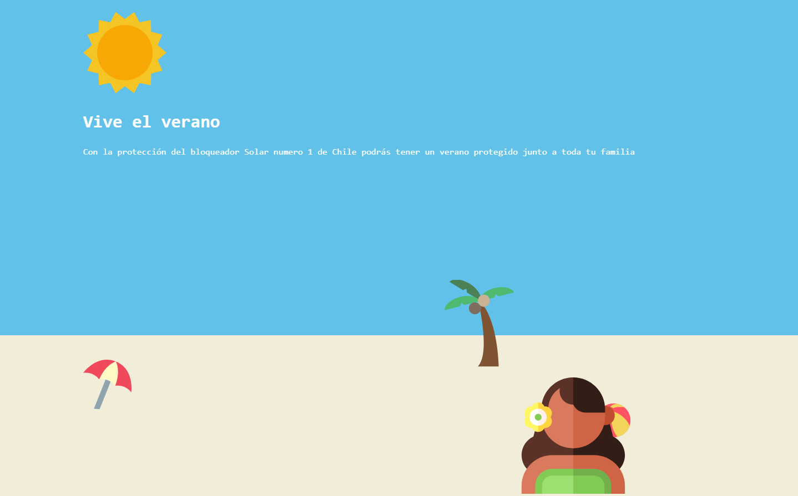

## Desafio "Vive el verano"

|Bootcamp 2022 Modulo 3|"Desarrollo de la interfaz de usuario web"|
|----|-----|
|**Unidad 4**|"SVG, transitions & animations"|
|**Día Bootcamp**|33|
|**Día Modulo**|11/15|

Este desafío consiste en aplicar transiciones y animaciones a imágenes vectoriales (SVG) que pueblan la vista. 

- [Utilidad para generar curvas Bezier](https://krofdrakula.github.io/css-animation-bezier/)